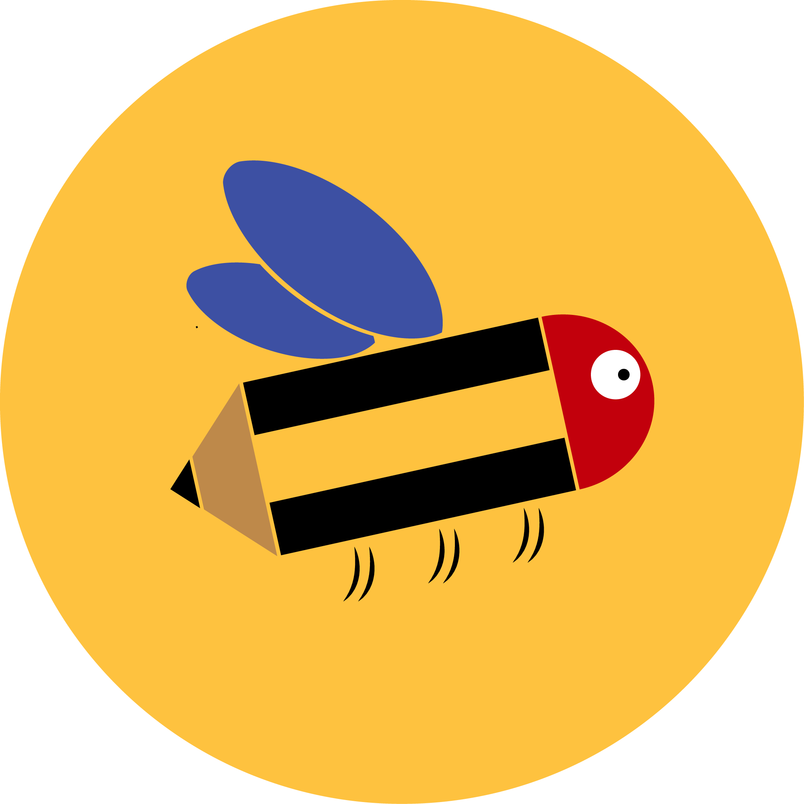

Lapis 🐝 is a mobile application that provides a meeting manager for professors and students within the university world, where a student can get insights and contents about courses held by a professor.  
<ul>
<li>Human Computer Interaction exam project.</li>
<li>Find all the details in our <a href="https://drive.google.com/file/d/1u38wj37tNZgt7WIIwjBcQqH9VG0aFYA8/view?usp=share_link">report</a></li>

